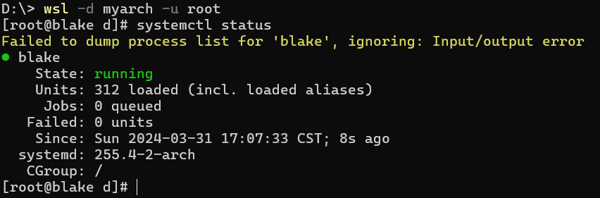
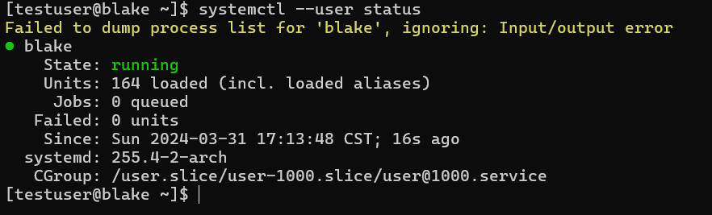
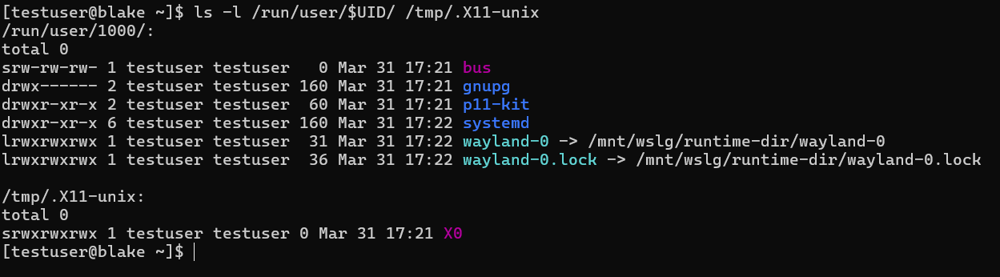
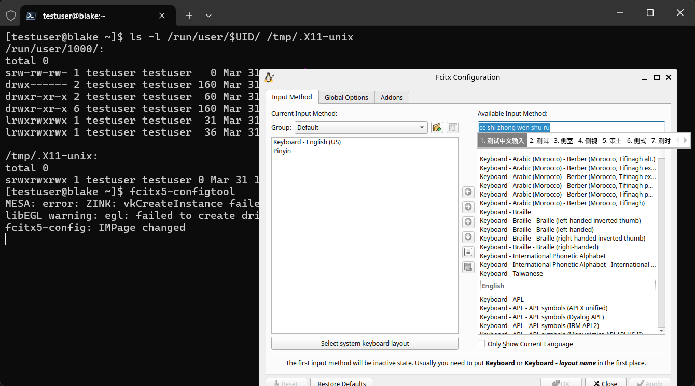

# easily create archlinux rootfs for WSL
> `docker build` 一键生成更适合中国宝宝体制的 `Arch Linux` WSL 根文件系统

## 特性
- 构建时直接滚动更新到最新系统
- `systemd/DBus` 开箱即用（系统态及用户态, `/etc/wsl.conf`）
- 已配置国内加速镜像及 `archlinuxcn` 软件源
- sudo 无需输入密码(`wheel` 组)
- 语言区域设置为 `en_US.UTF-8`
- 自动注入 Windows DNS (`/etc/wsl-boot.sh`)
- 已安装软件：`base base-devel wget curl zip unzip vim sed nano sudo texinfo man-db man-pages yay bash-completion net-tools openssh`

### WSLg 专属特性
> 创建时带上参数 `--with-wslg`
- 预装 Fcitx5 输入法（中文支持）
- 解决开启 systemd 后 X11 Socket 挂载问题(`wsl-x11-socket.service`)
- 解决开启 WSLg Wayland Socket 挂载问题(`wsl-wayland-socket.service`)

## 操作步骤

### 生成 rootfs (不带 `WSLg`)
> 约 289M
```bash
docker run -it --privileged --rm -v ./:/work -w /work archlinux:latest bash ./create-rootfs.sh
```

### 生成 rootfs (带 `WSLg`)
> 约 1.1G
```bash
docker run -it --privileged --rm -v ./:/work -w /work archlinux:latest bash ./create-rootfs.sh --with-wslg
```

### 导入 WSL
```powershell
wsl --import myarch D:/WSL D:/archlinux-rootfs-wslg.tar.gz --version 2
```

### 进入 WSL 并创建普通用户
```bash
wsl -d myarch

USERNAME=testuser
useradd -m -G wheel -s /bin/bash $USERNAME
passwd $USERNAME
sudo sed -i "s|^#default=.*|default=$USERNAME|" /etc/wsl.conf
```



### 关闭 WSL 并重新进入
```bash
wsl -t myarch
wsl -d myarch

systemctl --user enable --now fcitx5 wsl-wayland-socket
```


### 查看 sockets 及 DBus


### 中文输入法测试
> 运行 `fcitx5-configtool` 自行添加 `Pinyin` 布局


